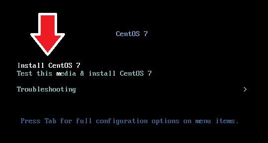
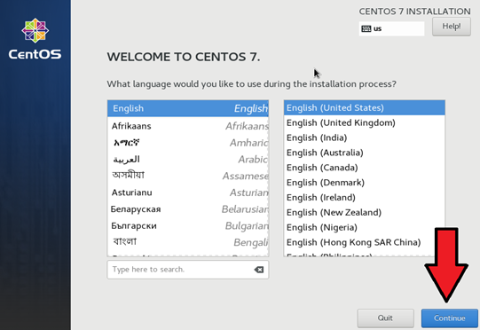
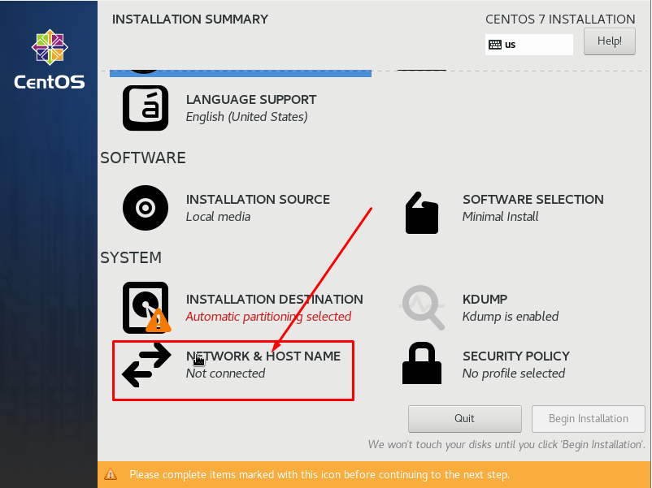
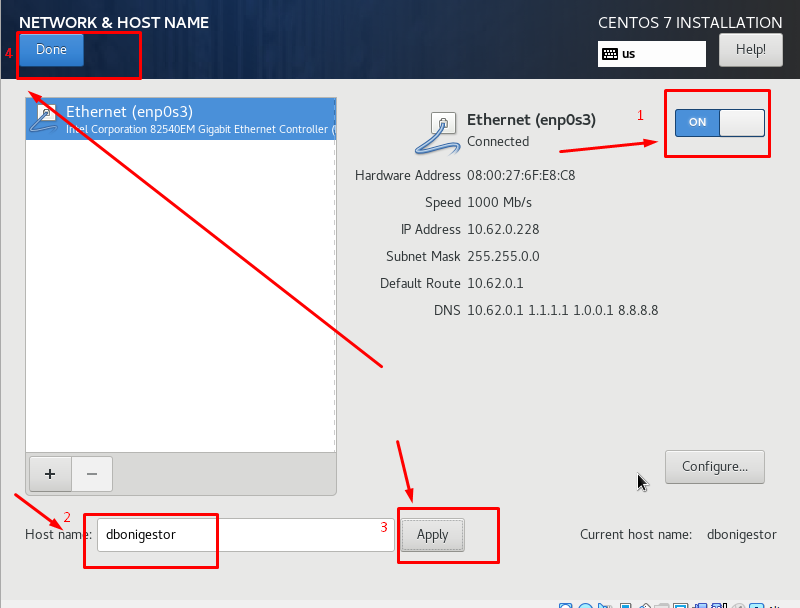
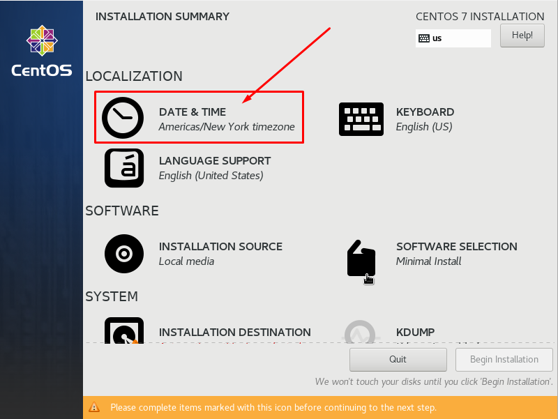

<h1 align="center">
  
</h1>

# Instalando SO CentOS 7.9

## Instalação
### Iniciando instalação
1. Faça boot da ISO ou do CD.

2. Utilizando as setas do teclado, selecione a opção "Install CentOS 7", então tecle Enter.

3. Aguarde alguns instantes até o surgimento do prompt de instalação. Em seguida, clique em “Continue”.

4. Selecione a opção “Network & Host Name” para configurar a rede e definir um nome para o host.

5. Ative a rede, defina um nome, aplique as configurções e clique em “DONE” para finalizar.

6. Selecione a opção “Date e Time” para selecionar seu fuso horário.

7. Selecione a região correspondente ao seu fuso horário, habilite o NTP e clique em “DONE” para finalizar.

# Outros documentos
- [Download ISO](README.md)
- [Instalando SO](01INSTALLSO.md)
- [Instalando Serviços](02INSTALLBD.md)

