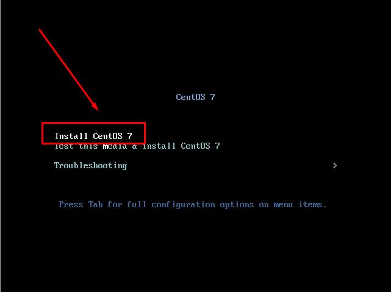

<h1 align="center">
  
</h1>

# Instalando SO CentOS 7.9

## Instalação
### Iniciando instalação
1. Faça boot da ISO ou do CD.

2. Utilizando as setas do teclado, selecione a opção "Install CentOS 7", então tecle Enter.

3. Aguarde alguns instantes até o surgimento do prompt de instalação. Em seguida, clique em “Continue”.

4. Selecione a opção “Date e Time” para selecionar seu fuso horário.

5. Selecione a região correspondente ao seu fuso horário.
