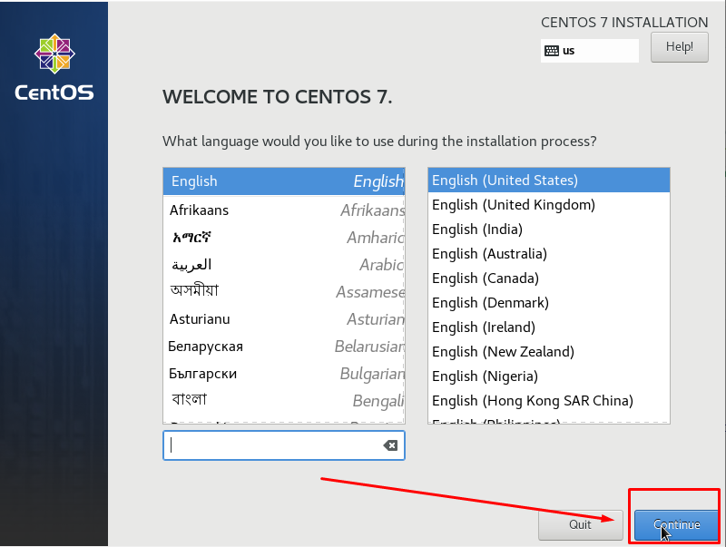
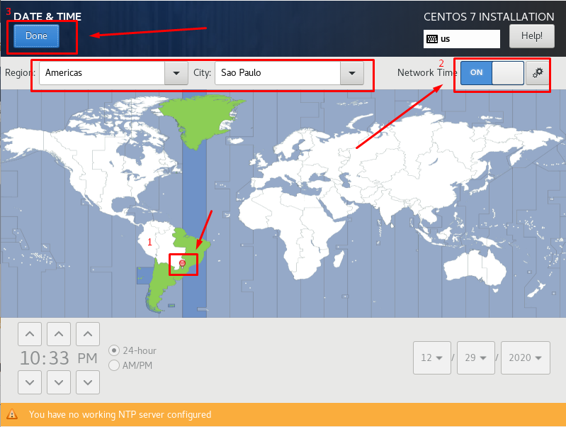

<h1 align="center">
  
</h1>

# Instalando SO CentOS 7.9

## Instalação
### Iniciando instalação
1. Faça boot da ISO ou do CD.

2. Utilizando as setas do teclado, selecione a opção "Install CentOS 7", então tecle Enter.

3. Aguarde alguns instantes até o surgimento do prompt de instalação. Em seguida, clique em “Continue”.

4. Selecione a opção “Network & Host Name” para configurar a rede e definir um nome para o host.

5. Ative a rede, defina um nome, aplique as configurções e clique em “DONE” para finalizar.

6. Selecione a opção “Date e Time” para selecionar seu fuso horário.

7. Selecione a região correspondente ao seu fuso horário, habilite o NTP e clique em “DONE” para finalizar.

8. Selecione a opção “Keyboard” para selecionar o layout do teclado.

9. Adicione o teclado Português(Brasil) , Remova o teclado English (us) e clique em “DONE” para finalizar.

10. Selecione a opção “Installation Destination” para configurar as partições de disco.

11. Marque a opção para configurar a partição e clique em “DONE” para ir para configuração.

12. Clique conforme imagem para gerar o padrão pelo sistema

13. Neste momento poderá ajusta o tamanho de disco para cada partição, não iremos usar o /home, após ajustar clique em “DONE” para finalizar.

14. Aceite as alterações, neste momento as alterações já serão gravadas no HD.

15. Tudo configurado, então clique para começa a instalação

16. Enquanto a instalação é executada defina senha o usuário “root” e crie o seu usuário no sistema caso deseje.

17. Ao finalizar a instalação reinicie o sistema.

18. Pronto o seu sistema já está instalado.
___
# Outros documentos
- [Download ISO](README.md)
- [Instalando SO](01INSTALLSO.md)
- [Instalando Serviços](02INSTALLBD.md)

