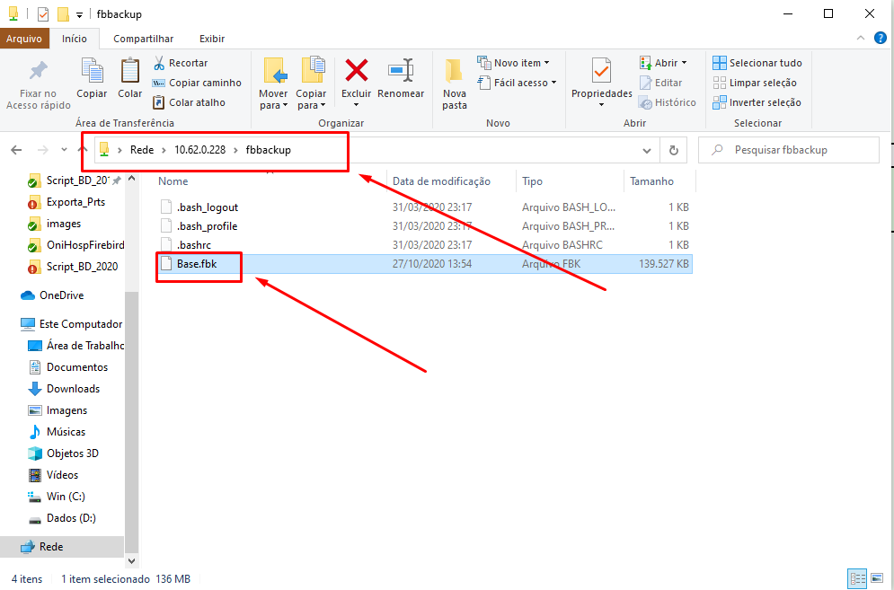

<h1 align="center">
  
</h1>

# Adicionando base de dados no servidor

Para adicionar a base de dados no servidor Linux a partir de uma máquina Windows pode usar de alguma formas.
- Compartilhamento de arquivo via rede
- FileZilla https://filezilla-project.org/download.php?platform=win64
- pscp https://the.earth.li/~sgtatham/putty/latest/w64/pscp.exe

## Usando o compartilhamento de arquivo via rede
1. Tecle a tecla “Windows” + “r” e digite “\\\ip_do_servidor” e clique em “OK”.

2. Informe o usuário e senha definido no samba.

3. Acesso o diretório do usuário e cole o arquivo no qual deseja colocar no servidor.

___
# Outros documentos
- [Download ISO](README.md)
- [Instalando SO](01INSTALLSO.md)
- [Instalando Serviços](02INSTALLBD.md)
- [Adicionando base de dados no servidor](03BASE.md)
- [Backup do banco de dados](04BACKUP.md)
- [Restore de backup](05RESTORE.md)
- [Trocando de usuário de rede](06REDE.md)

