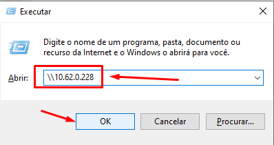

<h1 align="center">
  
</h1>

# Adicionando script para backup da base de dados

Para adicionar a base de dados no servidor Linux a partir de uma máquina Windows pode usar de alguma formas.

## Usando o compartilhamento de arquivo via rede
```
mkdir -p /opt/dba
wget https://raw.githubusercontent.com/HelionMendanha/OniHospFirebird/main/scriptBackupFirebird.sh -P /opt/dba
chmod +x /opt/dba/scriptBackupFirebird.sh
```

2. Informe o usuário e senha definido no samba.


3. Acesso o diretório do usuário e cole o arquivo no qual deseja colocar no servidor.


___
# Outros documentos
- [Download ISO](README.md)
- [Instalando SO](01INSTALLSO.md)
- [Instalando Serviços](02INSTALLBD.md)
- [Adicionando base de dados no servidor](03BASE.md)


