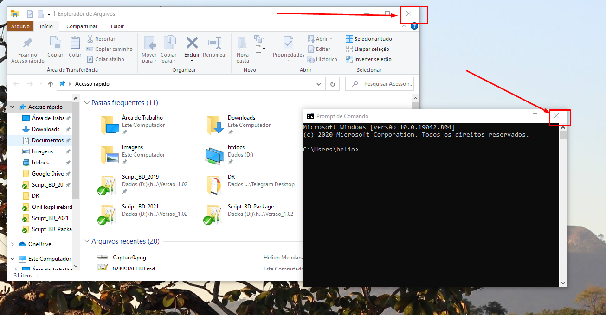

<h1 align="center">
  
</h1>

## Trocando o usuário de rede

Geralmente o usuário de rede está logado com o usuário **oni** e você precisar trocar para o **oniadmin** ou **fbbackup**, como fazer isso se Windows já não pede para colocar o novo usuário e senha?

1. Encerre/feche todos os "Explorador de Arquivo" e "Prompt de Comando"


2. Inicie um novo "Prompt de Comando" e execute o comando abaixo para ver as conexões ativas.
```
net use
```

3. Para remover todas conexões execute o comando abaixo no "Prompt de Comando" aberto inicialmente.
```
net use * /delete
```

4. Após deletar as conexões abrar um novo "Explorador de Arquivo" pelo "Prompt de Comando" com o comando abaixo.
```
explorer
```

> Não esqueça de após finalizar o trabalho de remover novamente todas as conexões e deixar logado com o usuário padrão.

___
# Outros documentos
- [Download ISO](README.md)
- [Instalando SO](01INSTALLSO.md)
- [Instalando Serviços](02INSTALLBD.md)
- [Adicionando base de dados no servidor](03BASE.md)
- [Backup do banco de dados](04BACKUP.md)
- [Restore de backup](05RESTORE.md)
- [Trocando de usuário de rede](06REDE.md)


